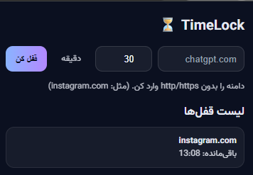
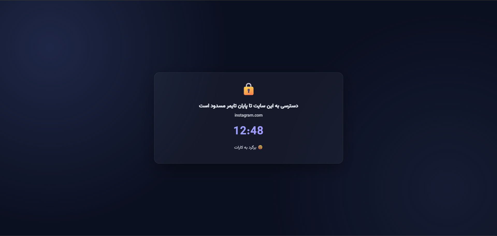

# ⏳ تایم‌لاک (TimeLock-Farsi)

اکستنشن مرورگر برای مسدود کردن سایت‌ها با تایمر.  
کافیه نام سایت رو وارد کنی، مدت زمان مشخص بدی، و تا پایان تایمر دیگه اون سایت باز نمی‌شه.

---

## ✨ امکانات
- مسدود کردن سایت‌ها بر اساس دامنه
- شمارش‌معکوس تا باز شدن دوباره سایت
- بدون نیاز به اینترنت یا سرور خارجی (همه‌چیز روی مرورگر شما ذخیره می‌شود)
- رابط کاربری ساده و فارسی

---

## 📦 نصب
1. [آخرین نسخه](./releases) را دانلود کنید و فایل ZIP را Extract کنید.
2. به مرورگر خود بروید:
   - کروم: `chrome://extensions/`
   - اج: `edge://extensions/`
3. حالت Developer mode را فعال کنید.
4. روی **Load unpacked** کلیک کنید و پوشه‌ی پروژه را انتخاب کنید.
5. آیکن اکستنشن در نوار ابزار ظاهر می‌شود ✅

---

## 🖼️ اسکرین‌شات‌ها

---

## 🔒 حریم خصوصی
هیچ اطلاعاتی به سرور خارجی ارسال نمی‌شود. تمام داده‌ها فقط در مرورگر شما ذخیره می‌شوند. [اطلاعات بیشتر](./PRIVACY.md)

---

## 📜 مجوز
این پروژه تحت لایسنس [MIT](./LICENSE) منتشر شده است.  

---
## 👥 همکاری و ایده
ایده‌ی این پروژه توسط [Parsa Pouramiri](https://github.com/ParsaPouramiri8) مطرح شد و توسعه‌ی کدها با کمک ChatGPT انجام شد.  
هدف اصلی این بود که یک نمونه‌ی کاربردی و ساده برای تمرکز و مدیریت زمان ساخته شود.
## 👥 Collaboration & Idea
The idea for this project was proposed by [Parsa Pouramiri](https://github.com/ParsaPouramiri8) and the code was implemented with the assistance of ChatGPT.  
The main goal was to create a practical and simple tool for focus and time management.

